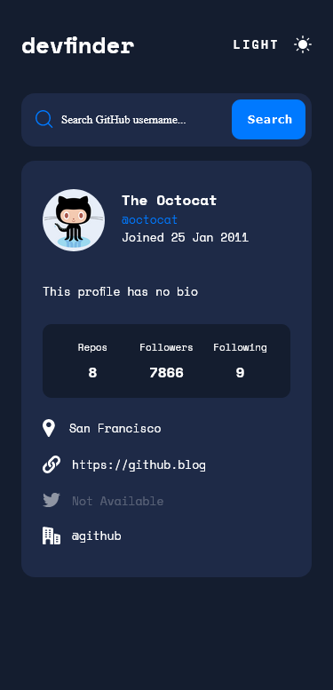
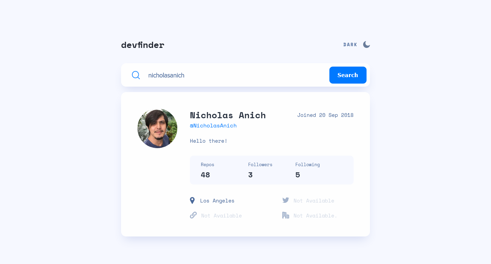

# GitHub User Search

## Table of contents

-   [Overview](#overview)
    -   [The challenge](#the-challenge)
    -   [Built with](#built-with)
    -   [Links](#links)
    -   [Screenshots](#screenshots)
-   [My process](#my-process)
    -   [What I learned](#what-i-learned)
    -   [Continued development](#continued-development)
    -   [Useful resources](#useful-resources)
-   [Author](#author)

## Overview

A simple React Application where users can search for GitHub Users. This utilized the GitHub Api.

### The challenge

Users should be able to:

-   View the optimal layout for the app depending on their device's screen size
-   See hover states for all interactive elements on the page
-   Search for GitHub users by their username
-   See relevant user information based on their search
-   Switch between light and dark themes
-   Bonus: Have the correct color scheme chosen for them based on their computer preferences. Hint: Research prefers-color-scheme in CSS.

### Built with

-   Semantic HTML5 markup
-   Vite
-   Typescript
-   CSS modules
-   SASS
-   Flexbox
-   Grid
-   Mobile-first workflow
-   GitHub API

### Screenshots

### Links

-   Solution URL: [Github](https://github.com/NicholasAnich/github-user-search)
-   Live Site URL: [Website](https://dapper-torrone-ab52d7.netlify.app/)

## My process

### What I learned

After getting the basic structure of your application down with mock data. Implement functionality and handle errors as soon as possible. Allow yourself to do one component at a time and ensure the stylings are good for mobile, tablet and desktop before moving onto the next one.

 

I had a great experience combining css modules with scss styling, allowing me to avoid global collisions while having the joy of nesting with scss.

### Continued development

Improve react form validation and typescript. Optimize page speed and accessibility.

### Useful resources

-   [Vite](https://vitejs.dev/) - Best react build tool at the moment.

-   [Axios](https://axios-http.com/docs/intro) - An excellent promise-based HTTP client for node.js. I prefer using this instead of fetch.

-   [Netflify Page Deployment](https://www.netlify.com/) - I use Netlify for deploment because I found github pages can sometimes be buggy.

-   [clsx](https://npm.io/package/clsx) - Finding a way to add classes in react is a little challenging but clsx offers an easy solution.

## Author

-   GitHub - [@NicholasAnich](https://github.com/NicholasAnich)
-   LinkedIn - [@NicholasAnich](https://www.linkedin.com/in/nick-anich/)
-   Frontend Mentor - [@NicholasAnich](https://www.frontendmentor.io/profile/yourusername)
